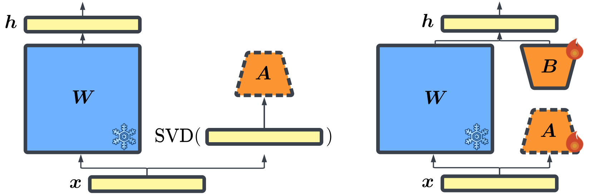

# One Initialization to Rule them All: Fine-tuning via Explained Variance Adaptation

This repository contains code for [EVA]()

**Authors:**

Fabian Paischer1*,
Lukas Hauzenberger1*,
Thomas Schmied1,
Benedikt Alkin1,3,
Marc Peter Deisenroth2,
Sepp Hochreiter1,3

* equal contribution
 1 ELLIS Unit, LIT AI Lab, Institute for Machine Learning, JKU Linz, Austria 
 2 University College London 
 3 NXAI GmbH, Linz, Austria 

## Method

Explained Variance Adaptation (EVA) is a novel intialization method for LoRA style adapters which initializes adapter weights in a data driven manner and adaptively allocates ranks according to the variance they explain.
EVA improves average performance on a multitude of tasks across various domains, such as Language generation and understanding, Image classification, and Decision Making.

The code for our image classification experiments can be found [here](https://github.com/BenediktAlkin/vtab1k-pytorch). All remaining experiments will be made available in this repository.
Our code supports all models that are made available through the huggingface hub.
We also provide an implementation of EVA in the [PEFT library](https://github.com/huggingface/peft) in this [pull request]().

## Instructions for fine-tuning with EVA

First, create a conda environment using `environment.yaml`

### SVD for EVA

Before fine-tuning with EVA, you need to create an SVD checkpoint. (the argument `svd_filepath` in `train.sh` needs to point to an existing SVD checkpoint).
To this end set the variables in `bash/run_svd_precompute.sh`, such as `base_path`, `model_names` and `dataset_name`, accordingly and execute it.
This will create a `eva_state_dict` in the specified directory.

### Fine-tuning

For fine-tuning, simply execute the `bash/run_train.sh` script. Prior to execution make sure to set crucial arguments such as `base_path`, `model_names` and `dataset_name`.

### Evaluation

- For evaluation on GSM8K and MATH, you can run the scripts `bash/run_eval_gsm8k.sh` and `bash/run_eval_math.sh`, respectively.

- For evaluation on common sense reasoning tasks run `bash/lm_eval_harness.sh`. 
**Note** that for this to work you need to first clone the [lm-eval-harness](https://github.com/EleutherAI/lm-evaluation-harness) repo and copy the custom tasks from the `lm-evaluation-harness/lm_eval
/tasks/` directory into the corresponding directory of the cloned repo. Finally, install `lm-eval-harness` via `pip install -e .` in the cloned repo.

## Reproducing results from the paper

In the following we list the hyperparameters for the math fine-tuning, common sense reasoning, and code fine-tuning tasks to reproduce the results from our paper.
After setting these parameters, you can execute the fine-tuning pipeline as explained above.

**meta-math/MetaMathQA**
- filter_long_context_examples False
- model_max_length 512
- batch_size 4
- gradient_accumulation_steps 2
- learning_rate 5e-4
- epochs 1

**qa_datasets**
- model_max_length 1024
- filter_long_context_examples True
- batch_size 4
- gradient_accumulation_steps 2
- learning_rate 5e-4
- epochs 1

**m-a-p/Code-Feedback**
- filter_long_context_examples False
- model_max_length 2048
- batch_size 2
- gradient_accumulation_steps 4
- learning_rate 5e-4
- epochs 1
